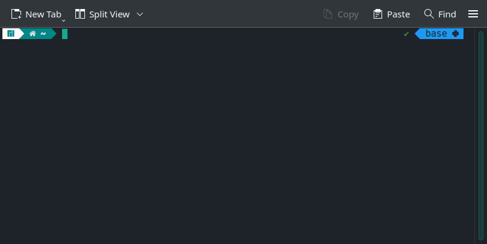
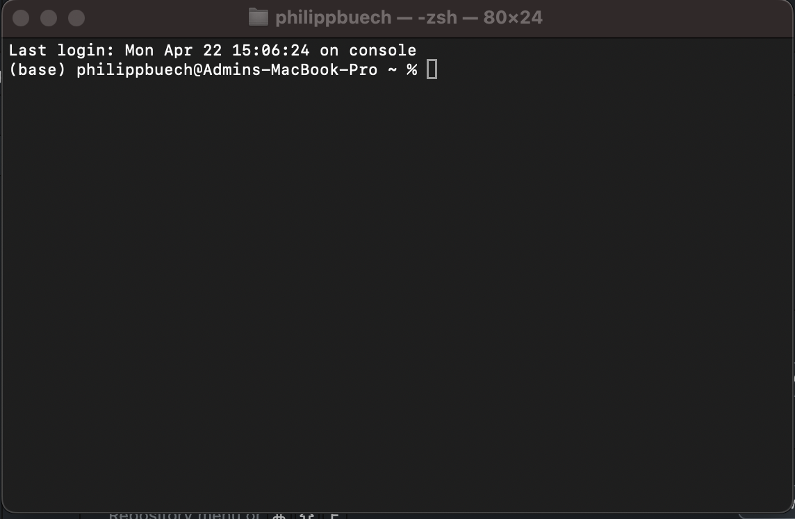
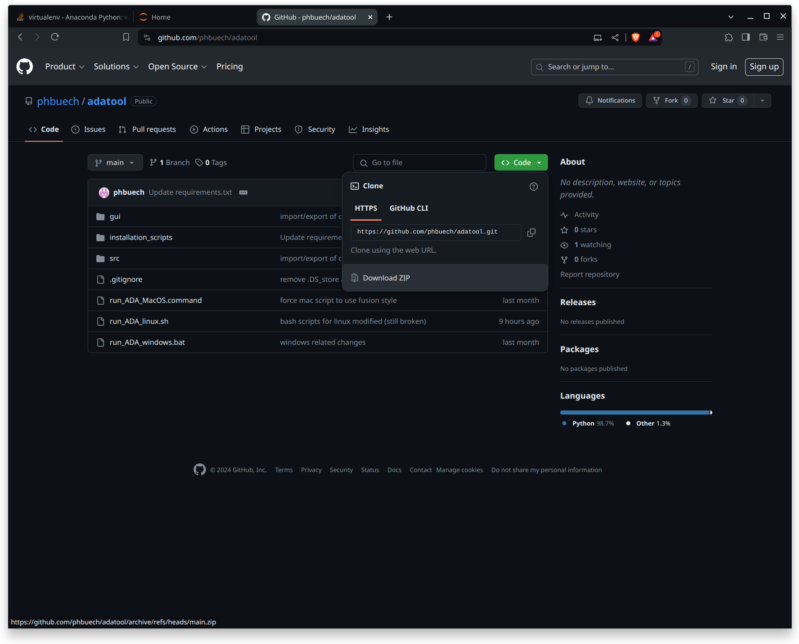
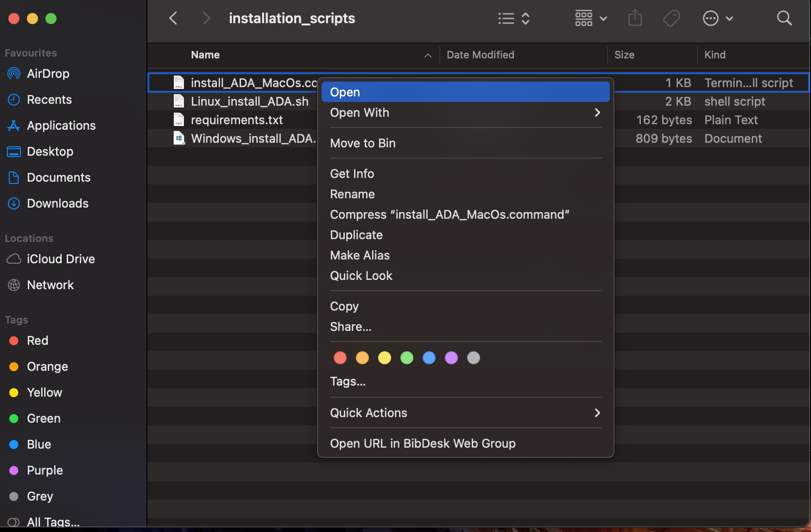
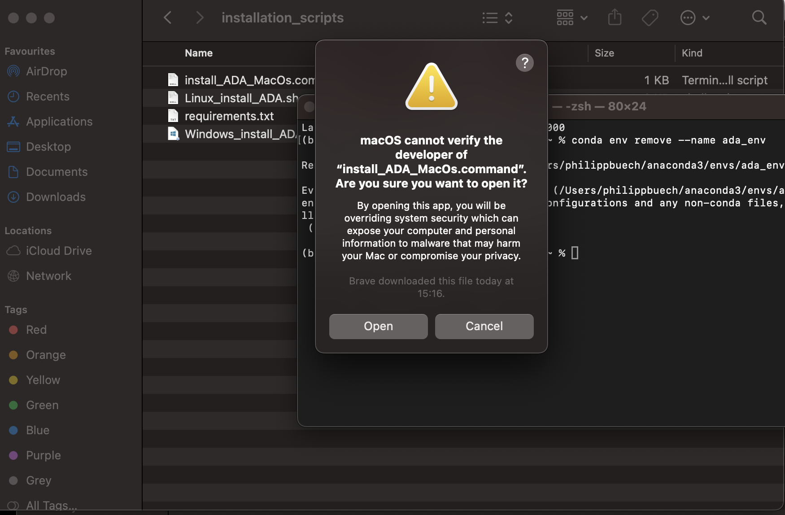
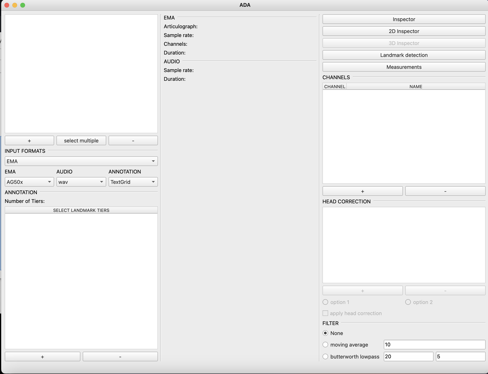

# ADA installation

## 1. Install anaconda

You can download Anaconda at _https://www.anaconda.com/download_. Skip the registration, because this is not necessary.

You can install Anaconda like any other program. If you need further information, you can follow the Anaconda installation instructions
- for Windows: https://docs.anaconda.com/free/anaconda/install/windows/
- for Mac: https://docs.anaconda.com/free/anaconda/install/mac-os/
- for Linux: https://docs.anaconda.com/free/anaconda/install/linux/

You can verify if Anaconda was succesfully installed, if you open the Terminal (Linux, Mac) and see _base_ or _(base)_ in the first line of your terminal. In Linux (Manjaro here), it should look like:



and the terminal in Mac should look like this:



If you use windows, you can enter "Anaconda prompt" in the search bar and you can open an anaconda terminal then:


## 2. Get a copy of ADA

You can download a copy of ADA on _https://github.com/phbuech/adatool_. Click on the button _<> Code_ and download a ZIP file:



Unpack the zip file and move it to the bin/trash.

## 3. Install dependencies

In the _adatool-main_ folder you will find a subfolder called _installation\_scripts_. You will find three installation scripts for different operation systems:
- for Mac: install_ADA_MacOS.command
- for Windows: Windows_install_ADA.bat
- for Linux: Linux_install_ADA.sh (maybe broken atm)

The procedures are explained in the following sections by operating system

### 3.1 Installation on Mac

Use the install_ADA_MacOS.command file for the installation on MacOS. A direct click on the script will not work, so it is necessary to open the dialog first and then click on _Open_:



A dialog window will appear:



Click on _Open_.
A terminal will open where you have to enter _yes_. The installation is done automatically.
It may be necessary to run the script two times.

### 3.2 Installation on Windows

### 3.3 Manual installation

If a manual installation is required, you can do this by opening the terminal (Anaconda prompt in Windows) and enter the following commands:
1) conda create --name env ada_env Python=3.10
2) conda install -c conda-forge mamba (this step is NOT necessary. mamba is an alternative package manager and is faster than the standard conda)

When this is done, you will find a _requirements.txt_ in the installation_scripts folder within adatool-main. This file includes the dependencies that have to be installed. Activate first the ada_env by entering the command:
3) conda activate ada_env
The install the requirements with
4) pip3 install -r /path/to/adatool-main/installation_scripts/requirements.txt

The requirements are now installed.

### 4. Run ADA

You can run now ADA by clicking one of the run_ADA scripts in adatool-main. These are, again, separated by the different operating systems:
- for Mac: run_ADA_MacOS.command
- for Windows: run_ADA_windows.bat
- for Linux: run_ADA_linux.sh (maybe broken)

If you use Mac, you have to open the dropdown menu (like in 3.1), click on _Open_, and in the following window again on _Open_ when you run ADA the first time on your machine.

Alternatively, if you want to start the program manually, you have to open the terminal (Anaconda prompt in Windows) and activate the anaconda environment first:
1) conda activate ada_env
Then you have to run the python file _main.py_ in the src subfolder in adatoolo-main:
2) python /path/to/adatool-main/src/main.py

You should see the main window of ADA now:




```python

```
